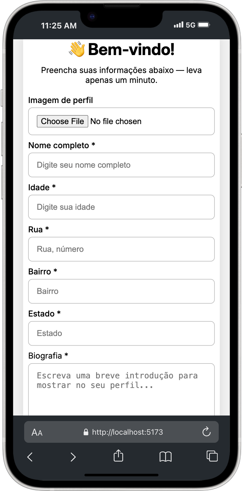
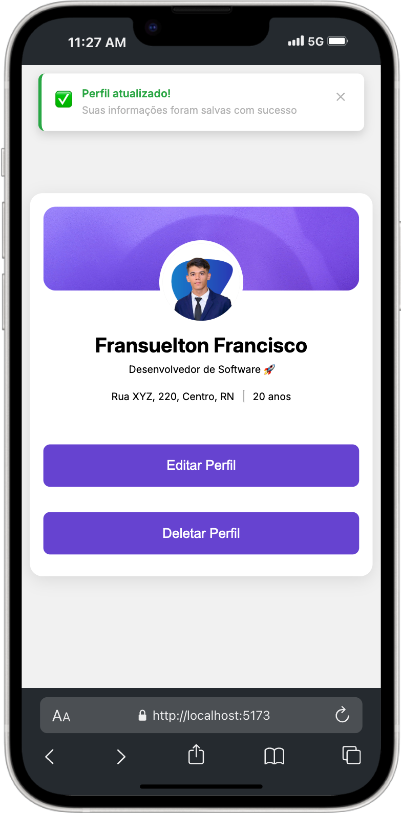
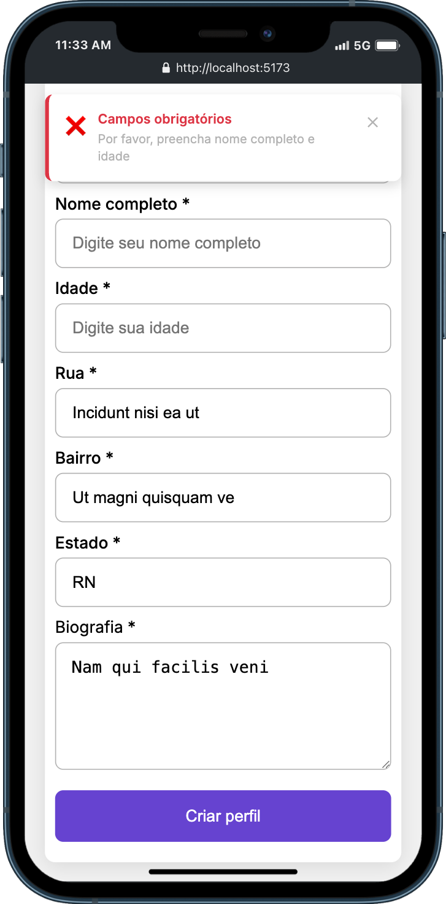

# 🧪 Technical Challenge - User Profile System


📌 Complete user profile system developed as a technical challenge. Modern fullstack application with Laravel + Vue.js, complete CRUD, image upload, validations and automated testing.

---

## 📚 Table of Contents

- [🧪 Technical Challenge - User Profile System](#-technical-challenge---user-profile-system)
  - [📚 Table of Contents](#-table-of-contents)
  - [📝 About](#-about)
  - [✨ Features](#-features)
    - [🏛️ Backend Features](#️-backend-features)
    - [🎨 Frontend Features](#-frontend-features)
  - [🧰 Tech Stack](#-tech-stack)
    - [📦 Core Technologies](#-core-technologies)
    - [🏛️ Backend Stack](#️-backend-stack)
    - [🎨 Frontend Stack](#-frontend-stack)
  - [🏗️ Architecture](#️-architecture)
    - [🏛️ Backend Architecture](#️-backend-architecture)
    - [🎨 Frontend Architecture](#-frontend-architecture)
    - [🌐 Integration Flow](#-integration-flow)
  - [🎨 Design \& Prototype](#-design--prototype)
  - [🖼️ Screenshots](#️-screenshots)
  - [🚀 Getting Started](#-getting-started)
    - [📋 Prerequisites](#-prerequisites)
    - [🔧 Installation](#-installation)
    - [🏛️ Backend Setup](#️-backend-setup)
    - [🎨 Frontend Setup](#-frontend-setup)
  - [🔌 API Documentation](#-api-documentation)
    - [Base URL](#base-url)
    - [Available Endpoints](#available-endpoints)
    - [Example Usage](#example-usage)
    - [Response Format](#response-format)
  - [🧪 Testing](#-testing)
    - [Backend Tests](#backend-tests)
    - [Frontend Build Test](#frontend-build-test)
  - [📁 Folder Structure](#-folder-structure)
  - [☁️ Deployment](#️-deployment)
    - [🌐 Live Demo](#-live-demo)
  - [🎯 What I Learned](#-what-i-learned)
    - [🏛️ Backend Development](#️-backend-development)
    - [🎨 Frontend Development](#-frontend-development)
    - [🌐 Full-Stack Integration](#-full-stack-integration)
    - [🎯 Project Management](#-project-management)
  - [📄 License](#-license)
  - [📬 Contact](#-contact)

---

## 📝 About

This project was developed as part of a **Technical Challenge for Developer Position at Sync360.io** to demonstrate fullstack development skills. The goal was to create a user profile interface with data editing and saving features, including image upload.

⏰ Estimated development time: [](https://wakatime.com/badge/user/3c70e005-2066-43a0-a02e-ce1a4fa6a5e7/project/f275b338-f6f5-4184-89e4-03f49eaa6c28)

📄 Project Initial sheet in: [Notion](https://www.notion.so/fransuelton/Perfil-de-Usu-rio-225f04ef50d08092834be066c856f5db)

---

## ✨ Features

### 🏛️ Backend Features
- 🔐 **Full REST API** - User CRUD with well-structured endpoints
- 📝 **Robust validations** - Form Requests with customized messages in Portuguese
- 📤 **Image uploads** - Support for multiple formats with size validation
- 🧪 **Automated tests** - 7 tests passing with full coverage
- 📊 **API Resources** - Consistent data transformation for frontend
- ⚙️ **Service Layer** - Separation of business logic from controllers
- 🗃️ **Accessors** - Automatically calculated `full_address` field
- 🛡️ **Error Handling** - Professional error handling

### 🎨 Frontend Features
- 📱 **Responsive design** - Mobile-first with optimized breakpoints
- 💬 **Toast notifications** - Professional visual feedback system
- 🏷️ **Dynamic titles** - SEO optimized with contextual titles
- 🧩 **Reusable components** - Modular and scalable architecture
- 🔧 **Composables** - Reusable logic following Vue 3 patterns
- 🎨 **Modern CSS** - CSS variables and utility classes
- 🌐 **Direct API Integration** - Native fetch API with inline HTTP calls

---

## 🧰 Tech Stack

### 📦 Core Technologies

[](https://skillicons.dev)

### 🏛️ Backend Stack
- **Framework:** Laravel
- **Language:** PHP
- **Database:** MySQL
- **Testing:** PHPUnit
- **Architecture:** MVC + Service Layer

### 🎨 Frontend Stack
- **Framework:** Vue.js 3 (Composition API)
- **Build Tool:** Vite
- **Router:** Vue Router 4
- **Architecture:** Component-based + Composables
- **Styling:** CSS Variables + Utility Classes
- **HTTP Client:** Native Fetch API (direct integration)

---

## 🏗️ Architecture

### 🏛️ Backend Architecture
```
┌─────────────────┐    ┌─────────────────┐    ┌─────────────────┐
│   Controllers   │ -> │    Services     │ -> │     Models      │
│  (HTTP Layer)   │    │ (Business Logic)│    │  (Data Layer)   │
└─────────────────┘    └─────────────────┘    └─────────────────┘
         │                       │                       │
         v                       v                       v
┌─────────────────┐    ┌─────────────────┐    ┌─────────────────┐
│ Form Requests   │    │  API Resources  │    │   Migrations    │
│  (Validation)   │    │ (Transformation)│    │   (Schema)      │
└─────────────────┘    └─────────────────┘    └─────────────────┘
```

### 🎨 Frontend Architecture
```
┌─────────────────┐    ┌─────────────────┐    ┌─────────────────┐
│     Views       │ -> │   Components    │ -> │   Composables   │
│   (Pages)       │    │ (UI Elements)   │    │ (Logic Layer)   │
└─────────────────┘    └─────────────────┘    └─────────────────┘
         │                       │                       │
         v                       v                       v
┌─────────────────┐    ┌─────────────────┐    ┌─────────────────┐
│  Direct API     │    │     Router      │    │     Styles      │
│  (Fetch Calls)  │    │  (Navigation)   │    │   (CSS Vars)    │
└─────────────────┘    └─────────────────┘    └─────────────────┘
```

### 🌐 Integration Flow
```
User Input -> Vue Component -> Direct API Call -> Laravel API -> Database
          <-              <-                  <-             <-
```

---

## 🎨 Design & Prototype

**Figma Prototype:** [View Interactive Prototype](https://www.figma.com/design/1c5BfSRRlJQvN5rRKnn4Ba/Desafio-T%C3%A9cnico-Sync360---Perfil-de-usu%C3%A1rio?node-id=0-1&t=2CLXNaIIeNm7kCCK-1)

The complete UI/UX was designed in Figma before development, ensuring a cohesive design system and optimal user experience across all devices.

---

## 🖼️ Screenshots

| Welcome Page (Mobile) | Profile Page (Desktop) |
|----------------------|------------------------|
|  |  |

| Toast Notifications | Toast Error Notifications |
|-------------------|----------------|
|  |  |

---

## 🚀 Getting Started

### 📋 Prerequisites

- **PHP** >= 8.2
- **Composer** >= 2.0
- **Node.js** >= 18.x
- **MySQL** >= 8.0
- **Git**

### 🔧 Installation

```bash
# Clone the repository
git clone git@github.com:Fransuelton/test-sync360.git

# Navigate to the folder
cd test-sync360
```

### 🏛️ Backend Setup

```bash
# Navigate to backend directory
cd backend

# Install PHP dependencies
composer install

# Copy environment file
cp .env.example .env

# Generate application key
php artisan key:generate

# Configure database in .env file
# DB_DATABASE=perfil_usuario_db
# DB_USERNAME=your_username
# DB_PASSWORD=your_password

# Run migrations
php artisan migrate

# Start the backend server
php artisan serve
# Backend available at: http://localhost:8000
```

### 🎨 Frontend Setup

```bash
# Navigate to frontend directory (in new terminal)
cd frontend

# Install Node.js dependencies
npm install

# Start the development server
npm run dev
# Frontend available at: http://localhost:5173
```

---

## 🔌 API Documentation

### Base URL
```
http://localhost:8000/api
```

### Available Endpoints

| Method | Endpoint | Description |
|--------|----------|-------------|
| `GET` | `/users` | List All Users |
| `GET` | `/users/{id}` | Get User by ID |
| `POST` | `/users` | Create New User |
| `PUT` | `/users/{id}` | Update User |
| `DELETE` | `/users/{id}` | Delete User |

### Example Usage

```javascript
// Create user with image
const formData = new FormData();
formData.append('full_name', 'João Silva');
formData.append('age', '30');
formData.append('street', 'Rua das Flores, 123');
formData.append('neighborhood', 'Centro');
formData.append('state', 'SP');
formData.append('biography', 'Desenvolvedor apaixonado por tecnologia');
formData.append('profile_image', fileInput.files[0]);

const response = await fetch('/api/users', {
    method: 'POST',
    body: formData
});
```

### Response Format

```json
{
    "success": true,
    "message": "User created successfully.",
    "data": {
        "id": 1,
        "full_name": "João Silva",
        "age": 30,
        "full_address": "Rua das Flores, 123, Centro, SP",
        "address_details": {
            "street": "Rua das Flores, 123",
            "neighborhood": "Centro", 
            "state": "SP"
        },
        "created_at": "08/07/2025 10:30",
        "updated_at": "08/07/2025 10:30"
    }
}
```

---

## 🧪 Testing

### Backend Tests

```bash
# Navigate to backend directory
cd backend

# Run all tests
php artisan test
```

### Frontend Build Test

```bash
# Navigate to frontend directory
cd frontend

# Test production build
npm run build
# ✓ Built in 693ms - Production ready
```

**Build Status:** 

---

## 📁 Folder Structure

```bash
test-sync360/
├── 🏛️ backend/                    # Laravel API
│   ├── app/
│   │   ├── Http/
│   │   │   ├── Controllers/        # UserController
│   │   │   ├── Requests/          # Validation classes
│   │   │   └── Resources/         # Data transformation
│   │   ├── Models/                # User model with accessors
│   │   └── Services/              # Business logic layer
│   ├── database/
│   │   ├── migrations/            # Database schema
│   │   └── factories/             # Test data factories
│   ├── routes/api.php             # API routes
│   └── tests/Feature/             # Integration tests
├── 🎨 frontend/                   # Vue.js SPA
│   ├── src/
│   │   ├── components/            # Reusable components
│   │   │   ├── ui/               # Basic UI components
│   │   │   ├── form/             # Form components
│   │   │   └── feedback/         # Toast notifications
│   │   ├── composables/          # Reusable logic (useToast, usePageTitle)
│   │   ├── scripts/              # Main app scripts (router, main)
│   │   ├── views/                # Page components
│   │   └── styles/               # CSS organization
│   ├── vite.config.js            # Build configuration
│   └── package.json              # Dependencies
└── 📖 README.md                  # This file
```

---

## ☁️ Deployment

### 🌐 Live Demo
- **Frontend (Vercel):** [https://test-sync360.vercel.app/](https://test-sync360.vercel.app/)
- **Backend API (Railway):** [https://test-sync360-production.up.railway.app](https://test-sync360-production.up.railway.app)

---

## 🎯 What I Learned

During the development of this project, I deepened essential knowledge for modern and robust web applications:

### 🏛️ Backend Development
- 🏗️ **Layered architecture** - How to structure a scalable API with Service Layer
- 🧪 **Testing strategies** - Implementation of automated tests with PHPUnit and factories
- 📋 **Advanced validation** - Custom Form Requests with Portuguese messages
- 📤 **File handling** - Secure upload with validations and method spoofing
- 🛡️ **Error handling** - Consistent error handling in REST APIs

### 🎨 Frontend Development  
- 🧩 **Vue 3 Composition API** - Migration from Options API to a more modern approach
- 🔧 **Composables pattern** - Creation of reusable logic following best practices
- 🌐 **State management** - Global state management without Vuex using composables
- 📱 **Responsive design** - Mobile-first with CSS variables and efficient breakpoints
- ⚡ **Build optimization** - Vite configuration for optimized production builds
- 🚀 **Direct API integration** - Simplified architecture with native fetch calls

### 🌐 Full-Stack Integration
- 🔗 **API design** - How to structure endpoints that facilitate frontend consumption
- 📋 **Dual validation** - Validation strategies both on frontend and backend
- 🎨 **UX patterns** - Implementation of loading states, error handling and visual feedback
- 🚀 **Production readiness** - Configuration for deployment and monitoring
- ⚡ **Simplified architecture** - Direct API communication without abstraction layers

### 🎯 Project Management
- 📖 **Documentation** - Creation of professional and complete technical documentation
- 🧹 **Code organization** - Project structuring to facilitate team maintenance
- 🔄 **Version control** - Efficient use of Git for fullstack projects

---

## 📄 License

This project is licensed under the MIT License. See the [LICENSE](./LICENSE) file for details.

---

## 📬 Contact

**Fransuelton Francisco**  
📫 contato@fransuelton.dev  
🌐 [fransuelton.dev](https://fransuelton.dev)  
🐙 [github.com/Fransuelton](https://github.com/Fransuelton)  
💼 [linkedin.com/in/fransuelton](https://www.linkedin.com/in/fransuelton)

---

⭐️ If this project was helpful to you, please consider leaving a star!